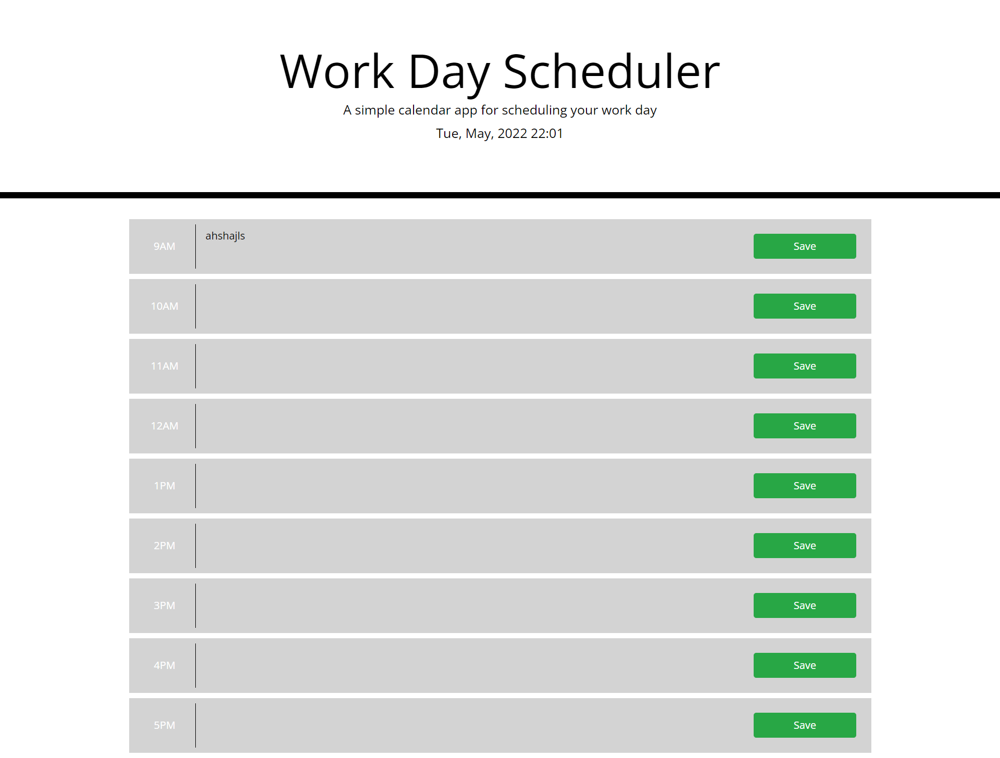

# day-planner

## user journey and purpose of app

this app is created for the purpose of making life more convenient for the user, to help maintain their schedule by creating a hourly planner
where the user can input an activity, meeting or any commitments etc; by an hourly basis.

## what i was tasked to do:

-When the user opens the planner then the current day is displayed at the top of the calendar
-Then th user is presented with timeblocks for standards business hours
-when viewing the timeblocks for that day, each timeblock is color coded to indicate whether it is in the past, present or, future

- Once the time blocks are clicked the user can enter an event which they can then click the save button.
  -The text is then saved in local storage
  -when the page is refreshed
  -the saved events are to be displayed

## My links

-github url: [https://github.com/abdinasir1993/day-planner](https://github.com/abdinasir1993/day-planner)

-deployed url:[https://abdinasir1993.github.io/day-planner/](https://abdinasir1993.github.io/day-planner/)

### desktop Viewports

